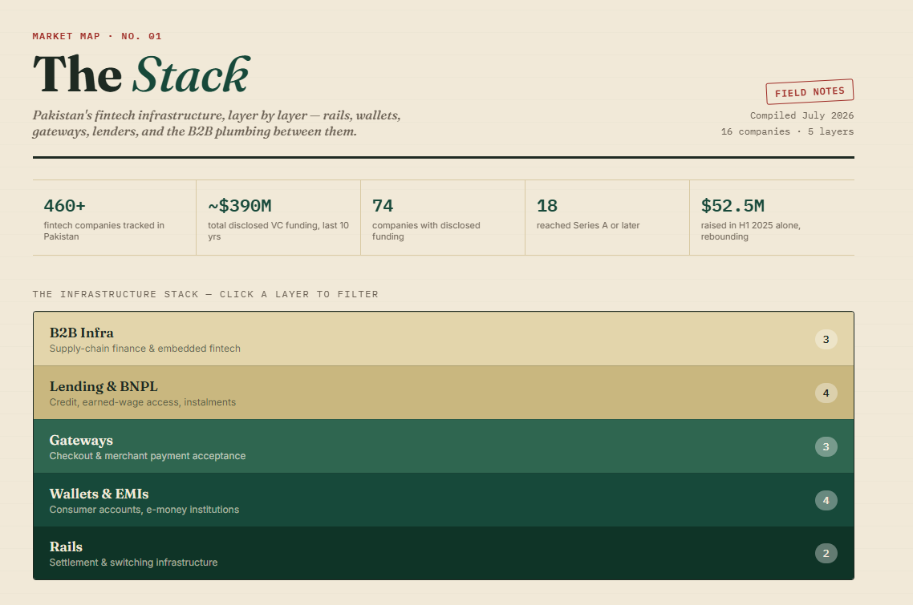

# The Stack - Pakistan Fintech Infrastructure Market Map

An interactive market map of Pakistan's fintech infrastructure, built as a deal-sourcing and sector-screening exercise.

**[Live demo →](#)** *https://arhamshaikhh.github.io/Pakistan-FinTech-Stack/*

## What it does

Maps 16 companies across Pakistan's fintech stack into five infrastructure layers:

- **Rails** - settlement and switching infrastructure (Raast, 1LINK)
- **Wallets & EMIs** - consumer accounts and e-money institutions (JazzCash, Easypaisa, NayaPay, SadaPay)
- **Gateways** - merchant payment acceptance (Safepay, PayFast, XPay)
- **Lending & BNPL** - credit, earned-wage access, instalments (Finja, Abhi, QisstPay, CreditBook)
- **B2B Infra** - supply-chain finance and embedded fintech (Haball, PostEx, Bazaar)

Each entry includes funding stage, disclosed amount raised, key investors, and a short analyst note.

## Why I built this

This is a series of on-going posts whose objective is to stay connected to the fintech industry within Pakistan and provide timely and accurate information for enthusiasts and investors alike

## Methodology & sources

Data compiled from public sources as of July 2026: Tracxn, Crunchbase, CB Insights, Forbes, The Express Tribune, PYMNTS, and company press releases. Funding figures reflect **disclosed** amounts only - several rounds are undisclosed or partially disclosed, so totals understate true capital raised. This is a market-mapping exercise, not investment advice.

## Built with

Vanilla HTML/CSS/JS 

## Possible extensions

- Pull live funding data via an API instead of a static dataset
- Add a second view scored on a simple investment rubric (team / market / traction / moat)
- Expand to other South Asian fintech markets for comparison

---
Built by Arham Shaikh · https://www.linkedin.com/in/arhamashaikh/ · arham.abrars@gmail.com
